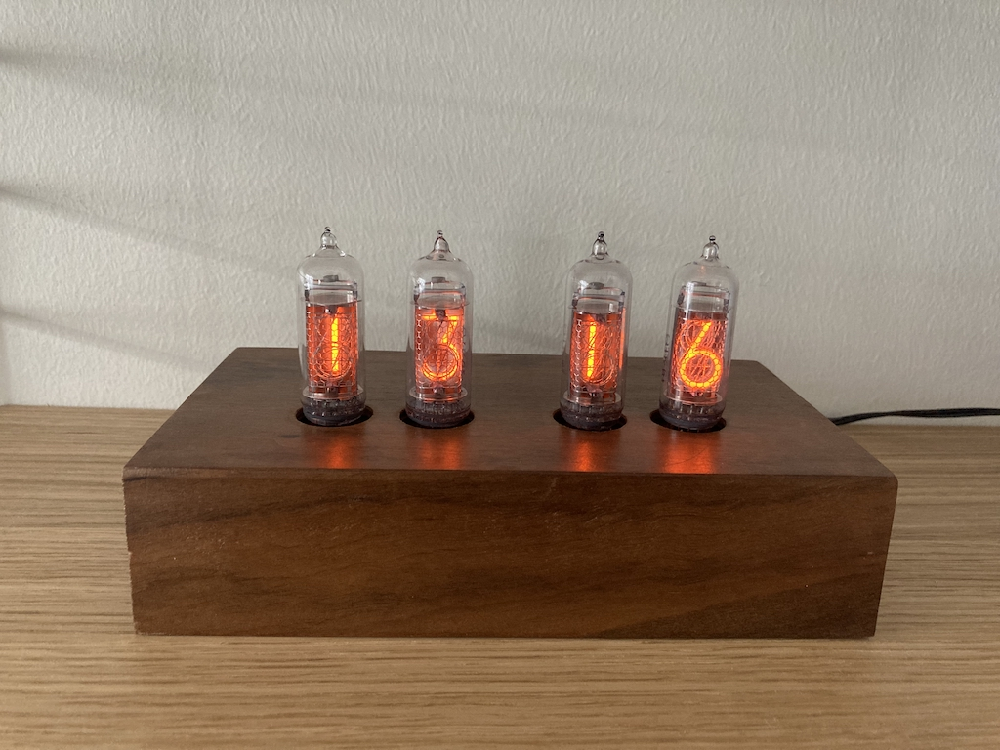
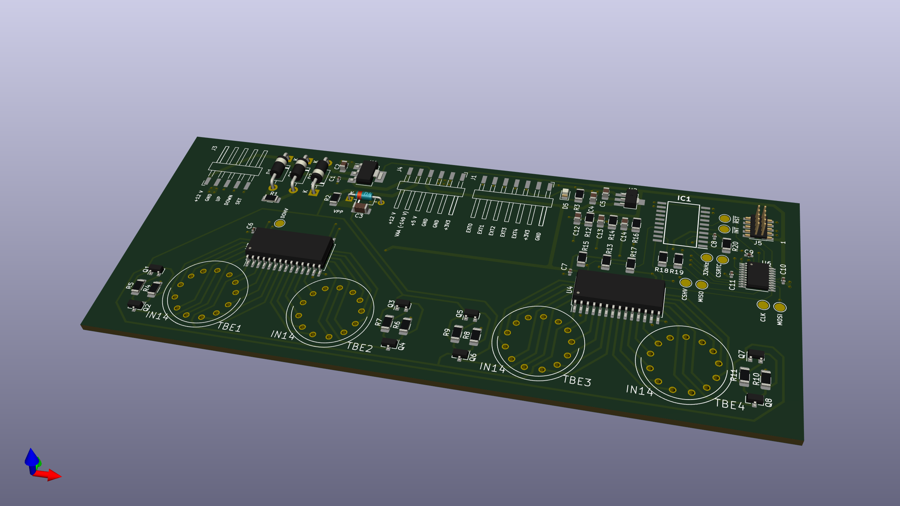

# Yet another nixie tube clock

- IN-14 tubes
- DC3234 RTC keeps the time
- Software written in Rust running on STM32L0
- Can show time or temperature sent over Bluetooth using an external BLE-SPI-bridge
- Use whatever step-up converter you want to

